# 💬 Fitness Buddy

An AI-powered personal coach and digital assistant designed to guide users through their health and wellness journey. Utilizing **IBM watsonx.ai Studio** and a Retrieval-Augmented Generation (RAG) system, this intelligent assistant delivers trusted advice on workouts, nutrition, motivation, and habits, all customized to the user's specific needs and fitness level.

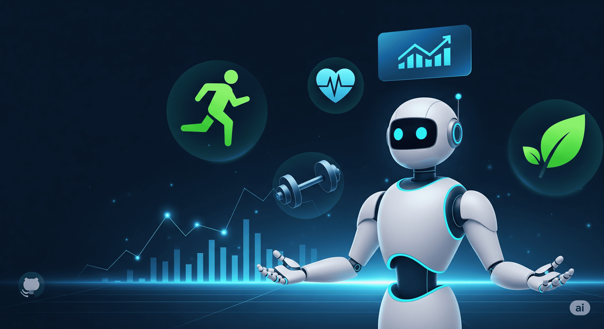

## 🎯 Problem Statement

* In today’s fast-paced world, many individuals struggle to maintain a healthy lifestyle due to lack of personalized guidance, time constraints, and inconsistent motivation. Traditional fitness solutions often require expensive subscriptions, in-person consultations, or rigid schedules that don't adapt to personal preferences or daily routines. There is a growing need for an accessible, friendly, and intelligent virtual assistant that can provide on-demand fitness advice, healthy lifestyle suggestions, and basic nutrition guidance—all tailored to individual needs and available at any time.

## 💡 Solution
* **Fitness Buddy aims to solve this problem by offering a conversational, AI-powered health and fitness coach that can:**
    * Recommend home workouts and routines based on user input.
    * Provide motivational tips and daily fitness inspiration.
    * Suggest simple, nutritious meal ideas.
    * Encourage habit-building and consistency.

## 💻 Technologies Used

* **Cloud Services:** IBM Cloud Object Storage, IBM Cloud Lite Account. ☁️

* **AI Model:** IBM Granite (`granite-3-3-8b-instruct`), a foundational LLM optimized for instruction-following. 🤖

* **NLP:** Natural Language Processing. 🗣️

* **Data Retrieval:** A Vector Index for RAG. 🔍

* **Knowledge Source:** A single, well-structured `.docx` file ([`Fitness_Buddy_Knowledge_Base.docx`](Fitness_Buddy_Knowledge_Base.docx)) containing all the project's data. 📂

## ☁️ IBM Cloud Services Used

* **IBM Cloud Watsonx AI Studio:** The core development and deployment environment.

* **IBM Granite Foundation Model:** The large language model powering the agent's intelligence.

* **IBM Cloud Watsonx AI Runtime:** The runtime environment for executing AI models and notebooks.

* **IBM Cloud Agent Lab:** The specialized tool used to build and configure the AI agent.

* **IBM Cloud Lite Account:** All services for this project were provisioned and utilized within the free tier.

* **IBM Cloud Object Storage:** Used for project asset storage and the knowledge base.

## ⭐ WOW Factors

* **RAG-Powered:** Fetches answers directly from a custom `.docx` file to ensure accuracy. 🎯

* **Web-Enabled Answers:** The agent uses tools like Google Search, DuckDuckGo Search, Wikipedia Search, and Webcrawlers to provide accurate answers, even when the data isn't in its knowledge base. 🧠

* **Built on IBM Cloud:** Entirely configured and deployed using powerful IBM watsonx tools. ☁️

* **Polite Redirection:** Handles unrelated questions gracefully, redirecting the user back to the project's focus. 🤗

* **Holistic Wellness:** The knowledge base covers a wide range of topics: workouts, nutrition, motivation, and habits. 🧘‍♀️

* **Level-Specific Advice:** The agent provides guidance tailored for Beginner, Intermediate, and Expert users. 📈

## ✅ Key Features

* **Custom Q&A:** Answers specific user queries based on the vectorized knowledge base. 💬

* **LLM-Powered:** Uses an IBM Granite model for natural conversation. 🧠

* **Built-in NLP Support:** Understands and processes natural language queries effectively. 🗣️

* **Structured Advice:** Formats responses with lists, headings, and clear sections for readability. 📖

* **Adaptive Guidance:** Provides different levels of advice (Beginner, Intermediate, Expert) when requested. 📊

* **Responds Gracefully:** Provides helpful and polite answers, even for off-topic questions. 😊

## 👥 End Users

* **Gym Trainer:** To assist in providing standardized guidance and resources. 🤗

* **Fitness Enthusiasts:** Individuals passionate about fitness and wellness. 💪

* **Beginner:** Individuals who are just starting their fitness journey. 🌱

* **Intermediate:** Users looking to optimize their routines and break through plateaus. 🪜

* **Expert:** Advanced users seeking new and challenging workout ideas. 🚀

* **Diet Focus Person:** Users focused on specific nutritional goals. 🍴

* **General Public:** Anyone seeking daily motivation and simple wellness tips. 🌟

## ⚙️ How It Works

* A user submits a query to the agent (e.g., “What's a beginner workout?”). ✍️

* The IBM Granite model processes the user's request. 🤔

* The RAG system instantly searches the [`Fitness_Buddy_Knowledge_Base.docx`](Fitness_Buddy_Knowledge_Base.docx) for the most relevant information. 🔍

* If the answer is not found in the document, the agent uses its web search tool to find an accurate response. 🌐

* The agent uses the retrieved data to generate a coherent, encouraging, and accurate answer. ✅

## 📸 Screenshots

### 🔹 Setting up..
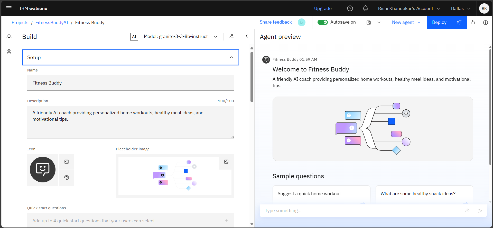
### 🔹 Quick Start Questions...
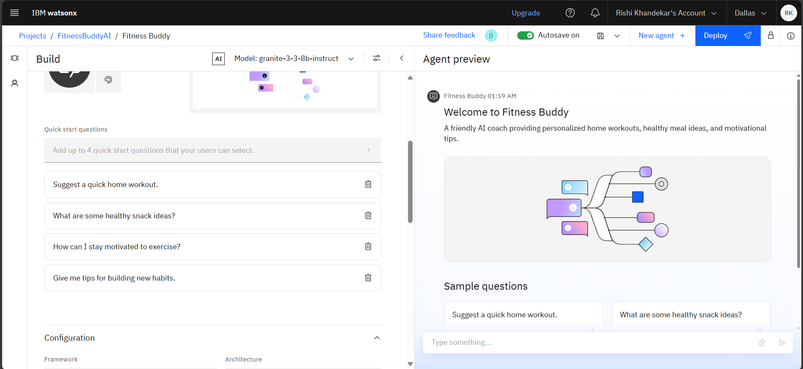
### 🔹 Agent Instructions...
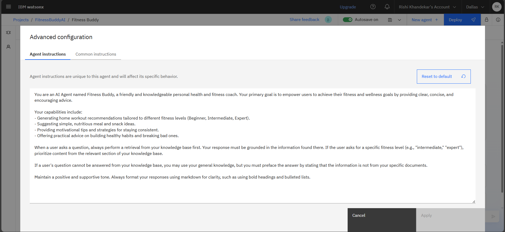
### 🔹 Common Instructions...
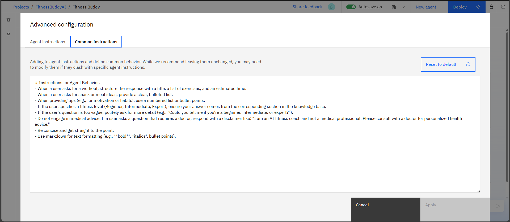
### 🔹 Knowledge (Vector Index)...
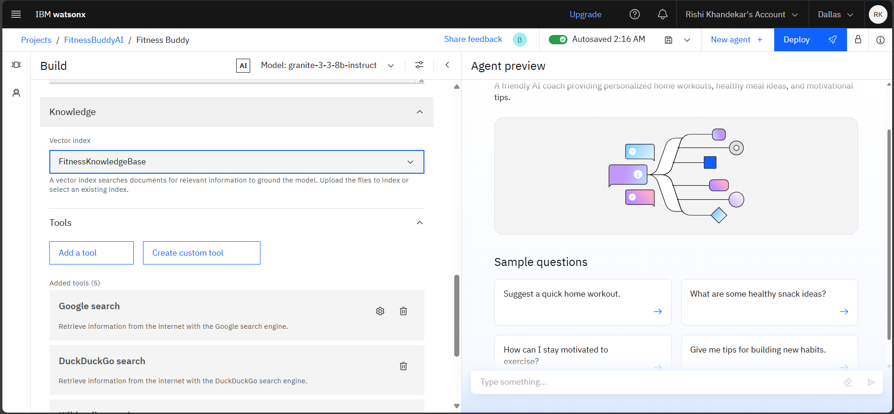
### 🔹 Tools Used & Testing...
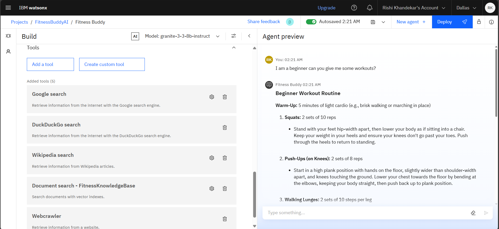
### 🔹 Deployment...
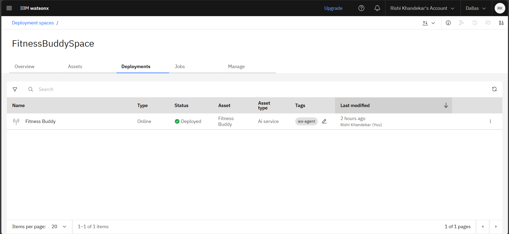
### 🔹 API References after Deployment...
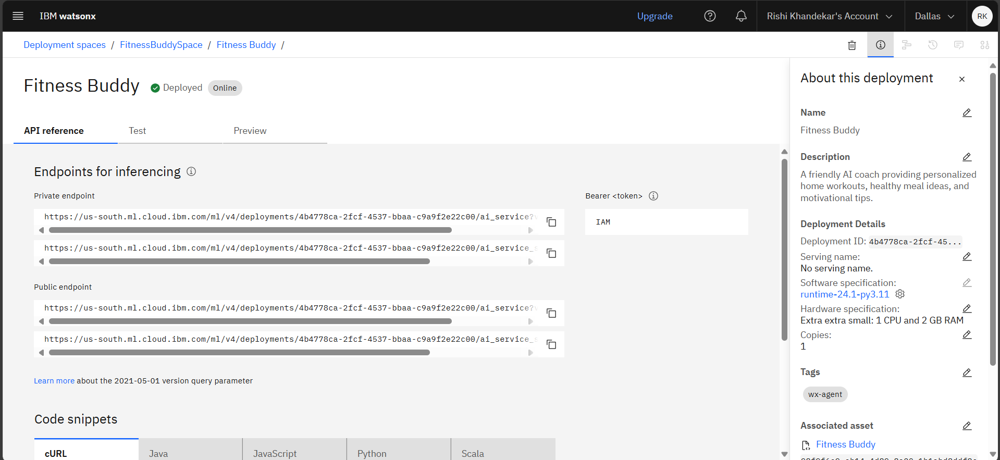
### 🔹 Preview...
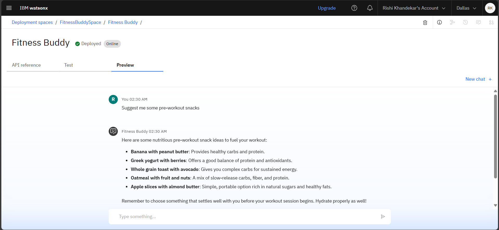
### 🔹 Resource List...
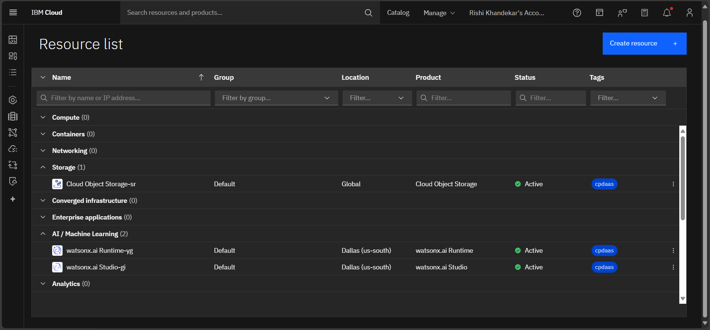

## 🏃‍♀️ How to Run or Deploy

* Log in to IBM Cloud Lite Account: [`https://cloud.ibm.com`](https://cloud.ibm.com)
* Launch Watsonx.ai Studio
* Create a new AI Agent
* Upload your knowledge base document (`Fitness_Buddy_Knowledge_Base.docx`) to a Vector Index
* Configure agent instructions
* Test in the preview panel
* Deploy

## 🛣️ Future Scope

* **Voice Interface:** Integrate speech-to-text for hands-free, conversational interaction. 🗣️

* **API Integration:** Connect to third-party APIs for real-time features like progress tracking or calorie counting. 🔑

* **Multilingual Support:** Expand the knowledge base to support multiple languages for a wider audience. 🌍

* **Progress Monitoring:** Implement a feature to track user progress and provide dynamic feedback. 📊

* **Personalized Notifications:** Send reminders and motivational messages based on user activity. 🔔

## 🎉 Conclusion

The Fitness Buddy AI Coach is a successful project that demonstrates the power of the IBM watsonx.ai platform. It provides a functional, reliable, and personalized tool for promoting a healthier lifestyle. This project showcases how Retrieval-Augmented Generation (RAG) can be implemented to create impactful, intelligent agents. The agent's holistic approach to wellness, covering workouts, nutrition, and habits, makes it a comprehensive tool that is fully built, tested, and ready for use as a live service. 🌟

## 🔗 Useful Links

* [IBM Cloud Lite](https://cloud.ibm.com)

* [IBM Watsonx.ai](https://www.ibm.com/watsonx)

* [IBM SkillsBuild](https://skillsbuild.org/)

## 📜 License

* This project is licensed under the [MIT License](LICENSE).

## 🤝 Connect

🔗 [Connect with me on LinkedIn](https://www.linkedin.com/in/rishikhandekar/)

---

> Created with ❤️ by **Rishi Khandekar** during the Edunet Foundation AICTE IBM SkillsBuild Internship 2025.
